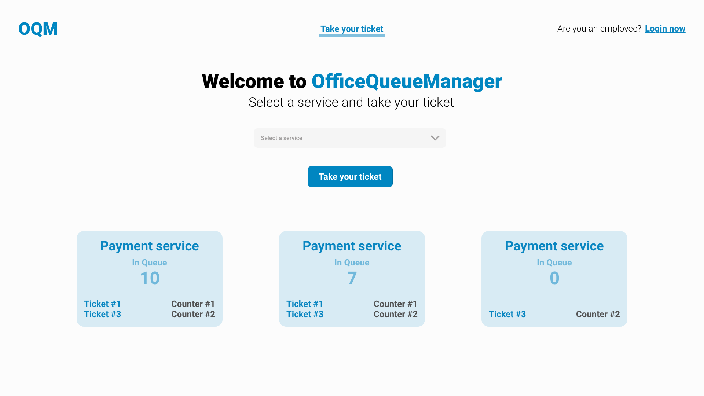
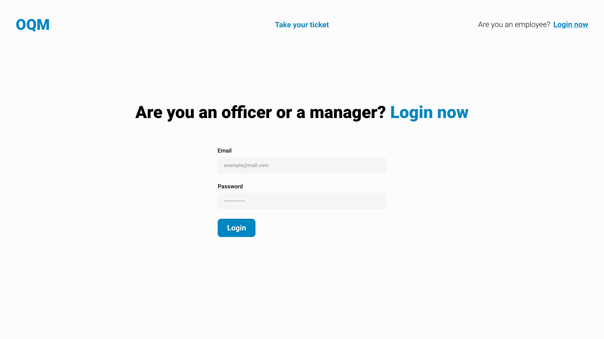
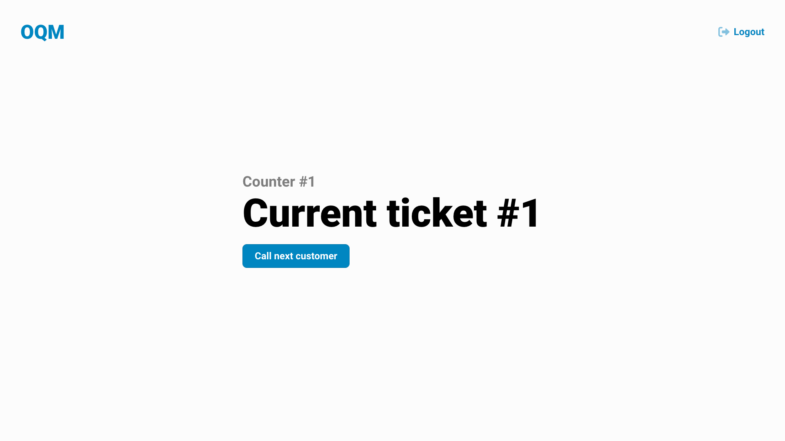

This project has been developed by Team-09 for the course of "Software Engineering II", attended during the academic year 2022/23 at Politecnico di Torino, Master's Degree in Computer Engineering.

## Table of Contents

1. [Technologies](#technologies)
   - [Frontend](#frontend)
   - [Backend](#backend)
   - [Database](#backend)
2. [React Client Application Routes](#react-client-application-routes)
   - [Route `/`](#)
   - [Route `/login`](#login)
   - [Route `/officer`](#officer)
   - [Route `/*`](#1)
3. [API Server](#api-server)
   - [Ticket Routes](#sessions-routes)
     - [`POST /api/v1/tickets`](#post-apiv1tickets)
     - [`PUT /api/v1/tickets/:counterId`](#put-apiv1ticketscounterid)
4. [Database Tables](#database-tables)
   - [Table `Ticket`](#ticket)
   - [Table `Service`](#service)
   - [Table `Counter`](#counter)
5. [React Components APIs](#react-components-apis)
   - [`UI Core`](#ui-core)
        - [Component `Input.Field`](#inputfield)
        - [Component `Input.Select`](#inputselect)
        - [Component `Display`](#display)
6. [Mocks](#mocks)

## Technologies

### Frontend

The language used is `Javascript` and the framework choosen is `ReactJS`.

Here the list of dependencies installed:

```json
"dependencies": {
    "@fortawesome/fontawesome-svg-core": "^6.2.0",
    "@fortawesome/free-regular-svg-icons": "^6.2.0",
    "@fortawesome/free-solid-svg-icons": "^6.2.0",
    "@fortawesome/react-fontawesome": "^0.2.0",
    "@testing-library/jest-dom": "^5.16.5",
    "@testing-library/react": "^13.4.0",
    "@testing-library/user-event": "^13.5.0",
    "autoprefixer": "^10.4.12",
    "axios": "^1.1.3",
    "bootstrap": "^5.2.2",
    "bootstrap-icons": "^1.9.1",
    "dayjs": "^1.11.5",
    "postcss-preset-env": "^7.8.2",
    "react": "^18.2.0",
    "react-bootstrap": "^2.5.0",
    "react-dom": "^18.2.0",
    "react-router": "^6.4.2",
    "react-router-dom": "^6.4.2",
    "react-scripts": "5.0.1",
    "sass": "^1.55.0",
    "web-vitals": "^2.1.4"
}
```

### Backend

The language used is `Javascript` and the framework choosen is `ExpressJS`.

Here the list of dependencies installed:

```json
"dependencies": {
    "cors": "^2.8.5",
    "express": "^4.18.2",
    "express-validator": "^6.14.2",
    "morgan": "^1.10.0",
    "nodemon": "^2.0.20",
    "sqlite3": "^5.1.2"
},
  "devDependencies": {
    "babel": "^6.23.0",
    "chai": "^4.3.6",
    "chai-http": "^4.3.0",
    "check-code-coverage": "^1.10.0",
    "jest": "^27.5.1",
    "mocha": "^9.2.2",
    "mochawesome": "^7.1.3",
    "mochawesome-report-generator": "^6.2.0"
}
```

### Database

We've choosen a relational database and the DBMS choosen is `SQLite3`.

For more info about the database structure, see [Database Tables](#database-tables).

## React Client Application Routes

### `/`

_This is the index route_

Homepage for guest users (not logged in users).

_This route is unprotected from the user authentication. Moreover, it is unreachable when the user is logged in._

### `/login`

Page that contains the login form to perform authentication.

_This route is unprotected from the user authentication. Moreover, it is unreachable when the user is logged in._

### `/officer`

The page shows the current ticket code that the officer has to serve and it allows the officer to compute the next ticket code to serve.

_This route is protected. The user must be authenticated as an Officer to navigate here._

### `/*`

Any other route is matched by this one where the application shows an error.

## API Server

### **Ticket Routes**

#### `GET /api/tickets/:counterId`

Get issued ticket associated to counterId.

**Request header:**

`Content-Type: application/json`

**Response body**

`HTTP status code 200 OK`

```json
{
   "ticket": {
      "TicketId": 5,
      "CreateTime": "2022-10-19 17:42:50",
      "ServiceId": 1,
      "Status": "issued",
      "CounterId": 1
   }
}
```

**Error responses**

- `HTTP status code 500 Internal Server Error` (generic server error)
- `HTTP status code 404 Not Found` (resource not found error)
- `HTTP status code 422 Unprocessable Entity` (validation error)

#### `POST /api/tickets`

Issues a new ticket for a selected service.

**Request header:**

`Content-Type: application/json`

**Request body:**

A JSON object containing the service id.

```json
{
   "serviceId": 1
}
```

**Response body**

`HTTP status code 201 Created`

```json
{
   "ticket": {
      "TicketId": 18,
      "CreateTime": "2022-10-19 17:42:49",
      "ServiceId": 1,
      "Status": "issued",
      "CounterId": 0
   },
   "waitingTime": 45
}
```

**Error responses**

- `HTTP status code 503 Service Unavailable` (generic server error)
- `HTTP status code 404 Not Found` (resource not found error)
- `HTTP status code 422 Unprocessable Entity` (validation error)

#### `PUT /api/tickets/:counterId`

Get next customer in line for services provided by a counter.

**Request header:**

`Content-Type: application/json`

`Params: req.params.counterId to retrieve the id of the counter for which to call the next customer.`

**Response body**

`HTTP status code 200 OK`

```json
{
   "ticket": {
      "TicketId": 18,
      "CreateTime": "2022-10-19 17:42:49",
      "ServiceId": 1,
      "Status": "issued",
      "CounterId": 1
   }
}
```

**Error responses**

- `HTTP status code 500 Internal Server Error` (generic server error)
- `HTTP status code 404 Not Found` (resource not found error)
- `HTTP status code 422 Unprocessable Entity` (validation error)

### **Service Routes**

#### `GET /api/services`

Get list of all affordable services.

**Request header:**

`Content-Type: application/json`

**Response body**

`HTTP status code 200 OK`

```json
{
   "services": [
      {
         "ServiceId": 1,
         "ServiceName": "s1Name",
         "ServiceTime": 10
      },
      {
         "ServiceId": 2,
         "ServiceName": "s2Name",
         "ServiceTime": 20
      }
   ]
}
```

**Error responses**

- `HTTP status code 500 Internal Server Error` (generic server error)
- `HTTP status code 404 Not Found` (resource not found error)

## Database Tables

### `Ticket`

It contains info about tickets.

```
TicketId (PRIMARY KEY)
CreateTime
ServiceId (FOREIGN KEY REFERENCES Service(ServiceId))
Status
CounterId (FOREIGN KEY REFERENCES Counter(CounterId)) (DEFAULT 0)
```

### `Service`

It contains info about services offered.

```
ServiceId (PRIMARY KEY)
ServiceName
ServiceTime
```

#### Preloaded Data

| ServiceId  | ServiceName | ServiceTime |
| :--------- | :---------- | :---------- |
| 1          | s1Name      | 10          |
| 2          | s2Name      | 20          |

### `Counter`

It contains info about counters, in particular which services are offered by each counter.

```
CounterId (PRIMARY KEY)
ServiceId (PRIMARY KEY) (FOREIGN KEY REFERENCES Service(ServiceId))
```

#### Preloaded Data

| CounterId  | ServiceId | 
| :--------- | :-------- |
| 1          | 1         |
| 1          | 2         |
| 2          | 2         |

## React Components APIs

### `UI Core`

#### `Input.Field`

_This component is located in_ `components/ui-core/Input.jsx`

It's a styled override of the React-Bootstrap form input field pattern.

| Prop | Type | Description | Required |
|------|------|-------------|----------|
|`id`|`String`|The id attribute for the input tag |Recommended|
|`type`|`String`|The type attribute for the input tag (e.g. Email, Password, Text)|Recommended|
|`name`|`String`|The name attribute for the input tag|Recommended|
|`placeholder`|`String`|The placeholder attribute for the input tag|Recommended|
|`label`|`String`|The label for the input field, shown above the field|Recommended|
|`className`|`String`|The class attribute for the inside wrapper of the component|No|
|`children`|`Any`|Text muted for a description or a message, shown below the field|No|

#### `Input.Select`

_This component is located in_ `components/ui-core/Input.jsx`

It's a styled override of the React-Bootstrap form select field pattern.

| Prop | Type | Description | Required |
|------|------|-------------|----------|
|`id`|`String`|The id attribute for the select tag |Recommended|
|`name`|`String`|The name attribute for the select tag|Recommended|
|`defaultValue`|`String`|The label for the default option|Recommended|
|`options`|`Array[{value: String, label: String}]`|The array of options, where each option is an object with keys value (value attribute of the option tag) and label (label of the option tag that is shown to the user)|Yes|
|`label`|`String`|The label for the select, shown above the field|Recommended|
|`className`|`String`|The class attribute for the inside wrapper of the component|No|
|`children`|`Any`|Text muted for a description or a message, shown below the field|No|

### `Display`

_This component is located in_ `components/ui-core/Display.jsx`

It's a component that shows queue info about a service.

| Prop | Type | Description | Required |
|------|------|-------------|----------|
|`service`|`{name: String, queue: Array[{code: Number or String, counter: Number or String}]}`|Service data that have to be shown.|Yes|

## Mocks

### Homepage



### Login page


### Officer page


### Manager pages
#### Statistics pages


#### Counters Configuration pages

.png)
.png)
